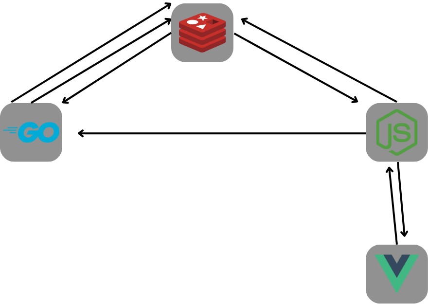

# Pingflow

Ce projet est un test technique auprès de l'entreprise [Pingflow](https://www.pingflow.com/).

L'objectif de celui-ci est d'évaluer les compétences du candidat sur une stack Golang, Vuejs et Node.js.

# Objectifs

## Golang
- Api: exposition d'un point de terminaison qui retourne de la donnée ✅
- traitement des données: les données transmises sont récupérées auprès d'une API externe et éventuellement traitées 🟨
- Redis: connexion à une base de données Redis, utilisation du système de publication/abonnement ✅
- Taches: mise en place d'un système de tâches en utilisant la publication/abonnement ✅

## Node
- Redis: connexion à une base de données Redis, utilisation du système de publication/abonnement ✅
- Golang: récupération des données via appel du point de terminaison ✅
- WebSocket: mise en place d'un serveur de websocket, transmission des données récupérées aux connexions HTTPS ✅
- Bonus: renouvellement des taches automatique par le serveur Node ✅

## Vue
- Websocket: récupère les données transmises par Websocket par le serveur Node, et les affiche ✅
- Composants: implementation de composants ✅
- Sass 🟨
- Pinia ✅
- Gestion d'erreurs ❌

# Mon implementation

Utilisation de l'executeur javascript [Bun](https://bun.sh/) pour Node et Vue

# Installation
necessite : docker, un runtime javascript

- creer un compte [opensky](https://opensky-network.org/login?view=registration)
- ajouter un fichier .env a la racine du projet avec le contenu du fichier .env.schema
- dans les variables OPENSKY_ACCOUNT_USERNAME et OPENSKY_ACCOUNT_PASSWORD, ajoutez respectivement votre identifiant et mot de passe opensky
- attribuer les numeros de ports manquants
- dans le dossier frontend, installez les dependences avec un manageur de paquet 
  - ideallement [Bun](https://bun.sh/) avec `bun i`
  - sinon node avec npm ou pnpm `npm i` | `pnpm  i`
- dans un shell, utiliser la commande `docker-compose up --build` ou `docker compose up --build` (depend de votre version/os)
- acceder a l'application via le port 3000 en local
