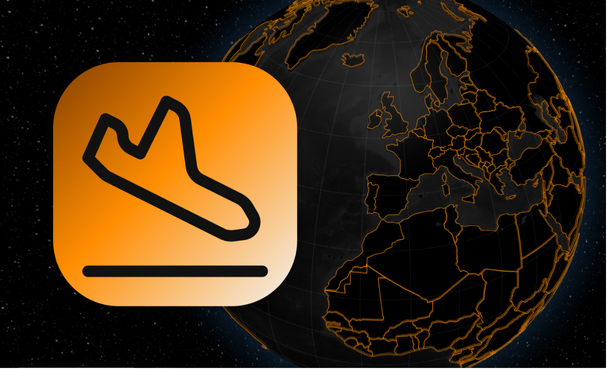

Radar d'avions permettant de visualiser les vols de France métropolitaine et de proximité. Le trafic évolue en temps réel. Inclut interfaces d'informations concernant les vols, et autres statistiques.
